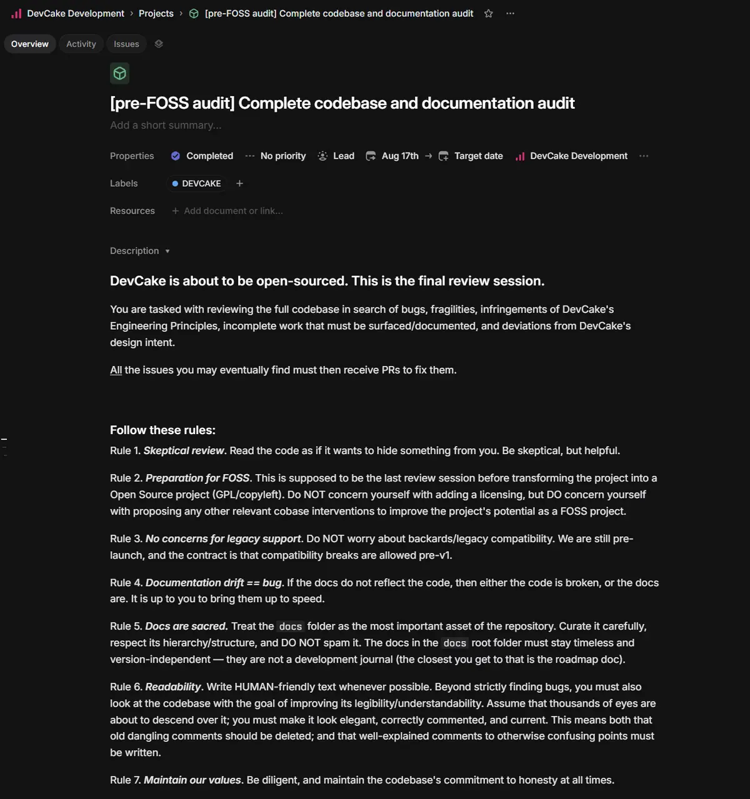
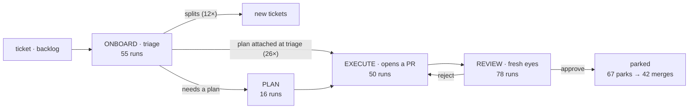
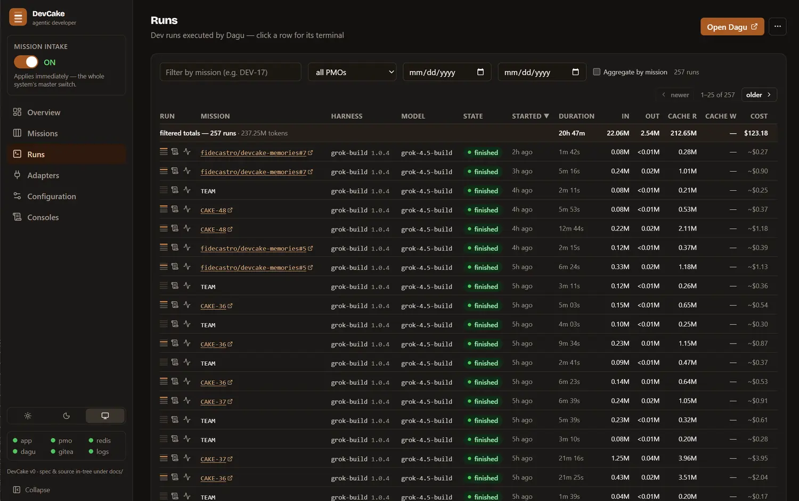
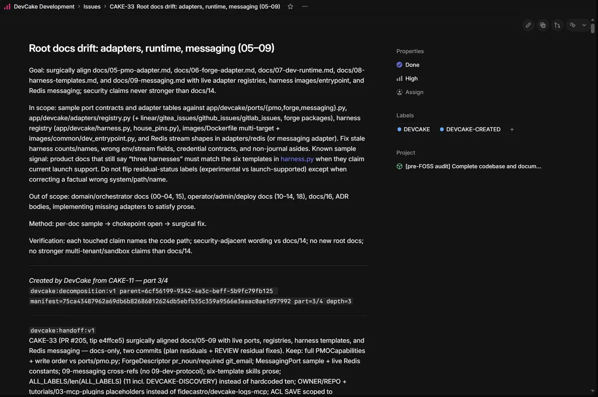
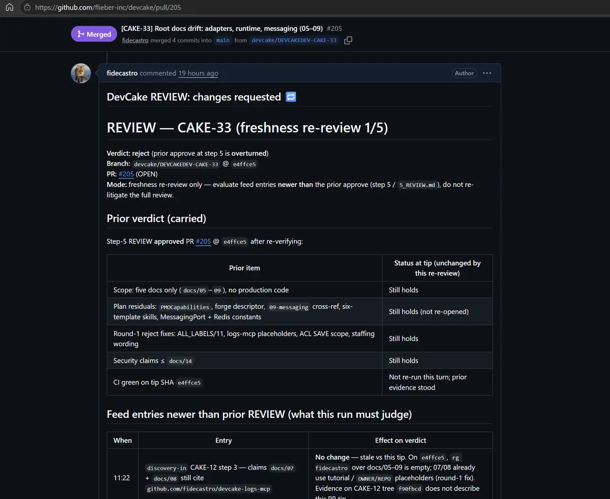

# DevCake audits DevCake

> **Field report · 2026-08-17/18.** A dated evidence document, not a timeless
> spec — the numbered docs stay authoritative for how the system works; this
> file records one thing the system actually did, with the paper trail. The
> interactive original of this report was published as a shareable page; this
> is its faithful in-tree port.

**We pointed DevCake at its own codebase.** One prompt on a project board
became fifty-four tickets, 257 agent runs, and forty-two pull requests — every
step legible on the board, every merge held for a human. Here is everything it
found, everything it got wrong, and the paper trail for both.

> **Read this first.** This is not a story about software that builds itself.
> A human launched the audit and owns the outcome. DevCake's agents wrote
> every pull request. An independent AI reviewer, running outside DevCake,
> then tried to break each one before anything merged. The point of DevCake is
> that last part — capability is cheap now; **accountability is the product**.

## One prompt, seven rules

DevCake is a self-hosted orchestrator that turns tickets on a project board
into supervised runs of coding agents — planned, executed, reviewed, and
merged with an audit trail at every step. Until now it had only been aimed at
other repositories. On August 17 we gave it its own: a single mission, written
as a project on the same Linear board our human team uses, asking for a final
review of the entire codebase.

Here is that prompt — not a paraphrase, the project itself, exactly as it ran.
There was no command line and no config file: the founder wrote this one
screen, and putting the `DEVCAKE` label on it is the gesture that set the
fleet loose. Everything else in this report descends from it.



*Figure 1. The entire input. The fleet's first triage read this screen at
08:01 and split it into eight issues.*

The subject is not a toy. What the fleet was asked to read, judge, and fix:

| | |
|---|---|
| **~95k** | lines of code, 400 files |
| **40,651** | test lines — more than the 30,377 they guard |
| **61** | docs · 139k words · 35 ADRs |
| **2,358** | tests · 71 API routes |
| **6** | agent harnesses |
| **7** | board & forge adapters |

Two of those numbers explain the audit's shape. The test suite outweighs the
code it tests — which is why "a fix isn't real until its test fails without
it" was enforceable. And the documentation corpus is a book's worth of words —
which is why "documentation drift is a bug" was a third of the work.

## From one prompt to forty-two branches

Nobody wrote fifty-four tickets. At 08:01 a single triage run read the project
and split it into eight scoped issues — documentation, orchestrator, adapters,
runtime, admin, security, ops, and one it judged small enough to work
directly. Then the process recursed: each new ticket got its own triage, and a
triage can decide the work is still too big and split again. Twelve did. By
10:45 the tree had grown to fifty-four tickets, three levels deep:

```
one prompt (the project)
 └─ first split: 8 issues
     └─ second wave: 29 tickets (12 of the 54 split themselves and stepped aside)
         └─ third wave: 17 tickets
             → 42 leaves → 42 pull requests → 42 human merges
```

A ticket that splits doesn't linger: it wires its obligations onto its
children — dependencies are copied before the parent steps aside, and any
failure to copy keeps the parent alive and blocking, so nothing can slip
through a half-built seam. The twelve split tickets canceled themselves; the
forty-two leaves did the work, and each one ended as a pull request.

The one deliberate serialization is worth a pause, because it shows the
machine reasoning about coherence. The forge audit split into a "pin the
shared substrate first" ticket and two per-forge audits, and marked the latter
two as blocked by the first. Blockers only clear when the blocking ticket is
*done* — and done, on this board, means a human merged its pull request. So
the two sibling audits waited overnight, ran the next morning against the
merged substrate, and never contradicted it. The human merge sat inside the
machine's own critical path, by construction.

One more choice shaped everything downstream: we left **auto-merge off**.
DevCake may approve its own fleet's work, but approval here ends in a parked
ticket that names a pull request and waits. All forty-two PRs crossed a human
threshold before touching the main branch.

| | |
|---|---|
| **1** | prompt, on the team's own board |
| **54** | tickets, self-decomposed |
| **257** | agent runs in two days |
| **42** | pull requests, all human-merged |
| **1,214** | board comments — the full trail |

## Triage, plan, build, review — in fresh heads

Each ticket moves through the same four stages, and each stage is a separate
agent run in a **fresh container**. Nothing carries over between runs except
what's written down: the ticket, its comment feed, the attached plans and
transcripts, and a read-only snapshot of the code. The board is the only
memory.



*Figure 3 (rendered from the original's counts). Triage split twelve tickets,
sent twenty-six straight to EXECUTE with an "opportunistic plan" written
during triage itself, and requested a dedicated PLAN run for sixteen. There
were more REVIEW runs than EXECUTE runs — the system re-reads more than it
writes. The four stages sum to 199 runs (the 55 triages include the project's
own); the other 58 of the audit's 257 ran outside this loop — 41 steward
routing passes, 16 memory-Curator runs, and one credential-wizard utility. And
67 is parks, not merges: with auto-merge off every approval parks, twenty-five
missions parked twice after forced re-reviews, and all sixty-seven parks
funneled into the forty-two merges.*

Why build it this way? Because long-running agents accumulate context the way
kitchens accumulate grease. An agent that has been reading code for three
hours carries assumptions it can no longer see; DevCake's answer is to make
every stage start cold, forced to work from the written record — which means
the written record has to be good, and stays good, because it is load-bearing.
The reviewer is never the author. The re-reviewer is never the first reviewer.
Fresh eyes are a renewable resource.

The discipline has a price, and this audit paid it visibly in one place: plans
are written down, so plans can go stale. One ticket ran its build a day after
its triage, into a tree that had absorbed forty merges — and its run opened by
checking the plan against the current tree, discovering its centerpiece had
already landed, and shrinking its own scope to what remained. Written-down
context can rot; it can also be re-verified, precisely because it is written
down.

Two more mechanisms complete the loop, and both matter later in this report. A
**freshness gate** refuses to let an approval stand if material comments
arrived after the reviewer read the feed — the verdict is withheld and a fresh
re-review is dispatched. And any run can emit **discoveries**: structured
findings beyond its own mission, which a steward process routes to the tickets
they concern. Both are why the count of REVIEW runs is seventy-eight and not
forty-two.

## What it ran on, and what it cost

Every fleet run rode the same stack: **Grok Build 1.0.4** as the agent
harness, driving **Grok 4.5**. That was a deliberate operator choice, not a
default — in our judgment it is a fast model that performs well on coding
work, and for this kind of task we prefer it to the newer Grok 4.6. Results
will vary with the model and harness you staff, and with everything those
choices drag along: Grok 4.5 gives each run a 500k-token context, with the
harness compacting around 400k — none of the 257 fresh-context runs ever got
near it.

None of the numbers below required archaeology. They are the **Runs tab** —
DevCake's operator ledger records, for every run, the model and harness
version, duration, per-step token counts, and an estimated cost priced against
published API rates. The audit's totals — 20 hours 47 minutes of cumulative
agent runtime, compressed into a morning by parallelism:

| | |
|---|---|
| **237M** | tokens processed, 3,382 turns |
| **213M** | of those were cache reads |
| **2.5M** | tokens written (1.6M reasoning) |
| **$123** | estimated at list prices |
| **$2.93** | per merged pull request |
| **<10%** | of one SuperGrok weekly quota |



*Figure 4. Every run's harness and model version, duration, token traffic, and
rate-card cost, filterable by mission and date, each row one click from its
full terminal. The totals row is this section's source: 257 runs, 237.25M
tokens, 20h 47m of cumulative run time, $123.18.*

One asterisk belongs on that dollar figure, in both directions. It is an
**estimate**, computed by DevCake's own rate card from measured tokens. And
the **marginal cost** of this audit was effectively zero: the fleet
authenticated through an existing SuperGrok subscription's OAuth, and the
whole two-day audit consumed less than a tenth of that subscription's weekly
token quota. $123 is what the tokens would have billed at API list prices;
what it actually spent was part of a subscription that was already paid for.

## A fix isn't real until someone tries to break it

Forty-two green checkmarks prove that tests pass, not that claims are true. So
before anything merged, review agents — grouped by domain, each blind to the
others, running outside DevCake — re-examined every pull request against a
hard standard: every claimed bug re-verified on the current main branch, every
new test run against the unfixed code to prove it fails without the fix, every
changed doc sentence checked against the code it describes, and everything
touching secrets, encryption, or data deletion reproduced live rather than
taken on faith. One reviewer combined its entire batch into one tree and ran
the full 2,358-test suite: zero regressions.

**31 merged as written · 11 corrected first · 0 rejected.**

## What the fleet found

These are the seven findings that mattered most — real bugs, confirmed by
independent reproduction, in code its own authors considered done. All were
fixed before this report was written.

| Area | Finding | Fixed |
|---|---|---|
| **Secrets** · `settings_bundle.py` | A password-protected settings bundle could carry hidden extra sections. The visible part looked harmless; after the passphrase was entered, the hidden part silently replaced operator-visible configuration. Unprotecting now decrypts only the sections a legitimate bundle can contain. | reproduced live · #198 |
| **Redaction** · `security.py` | Secret-masking kept a capped history of displaced entries. Past 64 of them, a live forge token could fall off the list and appear unmasked in activity logs. Keys are now content-addressed, so re-registering a token never displaces another. | driven past the cap in a test · #202 |
| **Data** · `run_store.py` | The counter that fences deleted run records lived only in process memory. After a restart, a stale write could resurrect records the operator had explicitly wiped. The fence is now an exact match, closing the fail-open path. | fails on old code, passes on new · #193 |
| **Data** · `api/clear.py` | Wiping run state revoked every per-run Redis user — but never saved the ACL file. A Redis restart quietly restored credentials the operator had just destroyed. The bulk revoke now persists, through the same adapter the per-run lifecycle uses. | verified against a live Redis · #194 |
| **Supply** · `staffing.py` | Agent containers may only launch from verified, receipted images. But the liveness check was skipped when the image builder had never checked in at all, and a receipt missing its verification stamp passed anyway. Both gates now fail closed. | both bypasses reproduced · #189 |
| **Routing** · `repo_routing.py` | On a board with zero configured repositories, a routing marker skipped the membership check entirely — any named repository became a valid work target across the board's boundary. The empty set now gates like any other. | #219 |
| **Ops** · `backup_gitea.sh` | Run without arguments, the internal-forge backup wrote a credentials tarball inside the checkout — one careless commit away from leaking. It now defaults to a permission-restricted directory outside the repository, matching its sibling script. | #207 |

## What the fleet got wrong

Eleven of the forty-two pull requests needed a correcting hand before they
could merge. Most of that was honest collision — the main branch kept moving
under the fleet — but five errors were the fleet's own, and they are worth
naming, because a demonstration that hides its misses isn't one:

- **A build flag removed on a false premise.** One PR deleted an explicit
  config-file flag, reasoning it was redundant. It wasn't: on a fresh clone
  the preferred build path would have failed and silently fallen back to a
  slower one. The comment justifying the change was factually wrong.
- **Delivery semantics mis-documented.** A docs pass stated that only
  *stalled* message groups get dead-lettered. In code, *any* message does
  after five failed deliveries — group progress merely defers it.
- **A broken link "fixed" wrong, twice.** The fleet repaired a dead
  documentation anchor with a slug that was still wrong — an em-dash in the
  heading produces a double hyphen. The durable fix was renaming the heading.
- **An off-by-one section pointer** sending readers to §4 of a protocol doc
  whose content lives in §3 — in a PR whose charter was that doc drift is a
  bug.
- **A promise its sibling had already declined.** A second-wave PR deferred a
  small hardening "to the sibling audit ticket" — which had already shipped,
  pins-only. The sentence would have been false the moment it merged; the
  three-line guard went in at review instead.

The fleet's work was good. It was not gospel. That gap is exactly what the
review layer is for.

## Every step happened where humans could see it

Here is the part that separates this from "an agent ran overnight and produced
a report": nothing happened in a back channel. The entire audit lives on the
same Linear board our human team plans its own week on — 1,214 comments across
the fifty-four tickets, every one timestamped, every one attached to the
ticket it concerns. Each run posts its full terminal transcript, its verdict,
and a per-step token and cost report. To audit any decision, you click the
ticket and read.

What that looks like in practice: here is CAKE-33, a documentation-drift
ticket that turned out to have the most eventful life on the board, exactly as
any teammate sees it in Linear — the scoped goal its parent wrote for it, the
machine-readable provenance marker (created by DevCake from CAKE-11, part 3/4,
depth 3 — one edge of the decomposition tree, printed on the ticket itself),
and the closing hand-off summary for whoever touches this surface next:



*Figure 5. Every element was written by the fleet: the scope its parent
carved, the verification bar it set for itself, and — after the work — the
hand-off note.*

And its comment feed, condensed:

| When | What |
|---|---|
| 08:53 · 17 Aug | Triage posts its transcript, verdict, and cost report; attaches an opportunistic plan — skipping the PLAN step — and three discoveries. |
| 08:55 – 10:24 | Eight findings from other tickets arrive, routed in by the steward, each stamped with its source and a receipt. |
| 10:46 | EXECUTE posts its transcript and opens the pull request: "🔀 opened/updated the pull request … awaiting REVIEW." |
| 10:53 | "🔁 REVIEW rejected (round 1) — back to EXECUTE." Full review report attached. A fresh build run addresses it. |
| 11:19 | "✅ REVIEW approved … Awaiting human merge" — the ticket parks, naming its PR. |
| 21:23 | The operator presses **Force freshness**. Two comments had arrived after approval — the gate withholds the verdict and dispatches a re-review. |
| 21:27 | "🔁 REVIEW rejected (round 2)" — the re-review found one routed-in finding was real and in scope. Another build run fixes it. |
| 21:45 | "✅ REVIEW approved … Awaiting human merge" — parked a second time. |
| 01:27 · 18 Aug | "✅ PR merged — mission done (merge sweep)" — after the human merged it. |

Fifty-seven comments, eighteen attached documents — transcripts, plans, review
reports, discovery files — and eight agent runs, readable top to bottom by
anyone with board access, in the tool they already use. Multiply by fifty-four
tickets and the audit left behind not a summary but a **corpus**: every plan
that was considered, every review that rejected, every dollar each step cost.

### And when it can't proceed, it says so — to a person

DevCake's failure posture is not retry-forever, and not silent-skip. It is:
stop, write down why, and address a human. This audit exercised that posture
in four distinct ways:

**Sixty-seven parked approvals.** With auto-merge off, every approval ends in
an explicit handover, and the message is written for the person, down to a
copy-paste command:

> "✅ REVIEW approved (APPROVED-BY-DEVCAKE marker). Awaiting human merge of
> …/pull/205 — the merge sweep completes this mission once it merges." —
> followed by the exact `gh pr review --approve … && gh pr merge` invocation,
> ready to paste.
> — *CAKE-33 feed, 2026-08-17 11:19 UTC · one of 67 such parks across 42
> missions*

**Two timed handbacks.** On the one board where auto-merge was on, two
approvals landed before their PRs were visible. DevCake said exactly what it
would do — "retrying for up to 30 minutes before handing back to you; you can
merge manually at any time" — then did exactly that, and both PRs were
finished by the human.

**Eleven refusal receipts.** When the discovery steward couldn't route a
finding, it didn't drop it — it posted a receipt with a human-readable reason
on the ticket: "⚠️ Unroutable — the source run record was cleared, so verbatim
transport is impossible; the full DISCOVERY file above remains the record," or
"terminal recipient" for a target already done. The refusal is part of the
trail.

**And one stranded ticket with its reason on the label.** When a race (the
epilogue below) stripped a ticket's stage label, DevCake refused to guess and
parked it — with the exact reason, "in_progress without stage label — not
DevCake's," printed on the mission row where the operator looks first. That
string is what turned a "why is this stuck?" into a five-minute diagnosis.

For honesty's sake: the hard escalation path — a run finishing with "a human
must decide this" — was **never triggered** in this audit. Zero occurrences,
verified in the event log. The asks above are the ordinary, designed-in kind:
every one of them appeared on the board, in words, addressed to a person.

## Discoveries, claims, and a wiki that argues back

DevCake's runs are deliberately memoryless — but the system is not. Any run
may emit **discoveries**: structured findings beyond its own mission, each
with a finding, evidence, and scope. This audit produced 132 discovery
harvests carrying 222 entries. They flow through two channels, and both left
receipts.

The first channel is **routing**. A steward process — forty-one passes during
the audit — reads fresh discoveries and proposes where they matter, delivering
them into other tickets' feeds as clearly-marked leads. 239 such deliveries
landed across forty-six of the fifty-four tickets, each stamped "leads, not
truths": the receiving run is expected to verify, not obey. Did that loop ever
change anything real? Once, demonstrably, end to end:

1. **17 Aug, 11:49** — A review run on CAKE-42 (CI scripts) discovers that an
   adapters doc falsely claims the CI pipeline runs *without* the bundled
   forge — the workflow actually exercises it.
2. **11:52** — The steward routes the finding into CAKE-33 — the ticket that
   owns that doc — with a targeting note. But CAKE-33 had been approved 33
   minutes earlier and was already parked.
3. **21:23** — The operator presses Force freshness. The gate finds two unread
   comments on CAKE-33 and withholds the standing approval.
4. **21:27** — A fresh re-review reads both routed leads, discards one as
   stale, confirms the other as a real in-scope factual error, and overturns
   the approval: "reject (freshness re-review overturns prior approve)."
5. **21:34** — A build run makes the one-line correction; a final review
   re-approves; the ticket parks again.
6. **18 Aug, 01:27** — The human merges. The routed discovery's correction is
   in the merged diff.



*Figure 6. Step 4 of the chain, as it posted to the pull request: the
re-review carries the prior verdict forward item by item, judges only the feed
entries newer than the last read — the visible row discards the stale lead
with evidence — and declares the overturn in its first line.*

One ticket's finding crossed the board, survived a skeptical re-review that
rejected its stale companion, and ended up in the main branch — with every hop
of that journey sitting in public comments. The same loop also prevented
duplicate work: a review on one forge ticket received its sibling's discovery
that a shared bug was already fixed in the sibling's PR, and recorded "do not
re-implement" instead of writing the patch twice.

### The conveyor and the Curator

The second channel is **memory**. Every discovery is also copied — by the
app, never by an agent — into a private repository that serves as the
deployment's notebook, as one small JSON claim file per finding. The audit
exfiltrated 208 claims this way (172 during the audit window itself, the rest
during the evening re-review wave and next-day residuals; the count is exact,
from the notebook's git history — 126 conveyor commits whose recorded totals
sum to precisely 208).

Claims are unvalidated leads, and they don't pile up. An hourly scheduled
task — the **Curator** — opens its own mission on the notebook's board, drains
the queue, and maintains what the filing policy calls a persistent,
compounding wiki: twenty-eight interlinked pages (entities, concepts,
operations), each carrying provenance back to the claim ids that ground it.
Four Curator drains processed all 208 claims down to an empty queue. The
notebook is mounted read-only into subsequent runs — a house encyclopedia the
fleet consults at triage.

The part worth staring at is the epistemics. The second drain ran while the
fleet's fix PRs were still unmerged — so fourteen claims saying "fixed" could
not be verified against the tree the Curator could see. It did not promote
them. It quarantined them in a `contradictions.md` with a warning — "do not
promote 'fixed' as fact until grepping the live modules succeeds" — and then,
in later drains, superseded each row as the fixes actually landed, citing the
tree revision it checked. It even corrected its own bookkeeping once, filing a
provenance-repair note when a review caught six claim ids deleted without a
backing entry. A memory that verifies, quarantines, and argues with itself is
the difference between a knowledge base and a rumor mill.

**Honest limits:** the notebook was consulted (twenty run logs reference it,
and one triage explicitly read its forge notes), but the demonstrable
outcome-changer in this audit was the discovery routing loop above, not
notebook content — the wiki's compounding value is a bet on the next hundred
audits, not a claim about this one. And the memory pipeline flagged one bug in
itself along the way, which went on the follow-up list.

## Epilogue: the morning after, it bit its own auditor

The day after the merge, one ticket sat frozen. CAKE-48 had run its triage,
attached a plan — and then two of DevCake's own writers collided: in the same
second that finalize stamped the ticket's next stage label, the discovery
steward retired a *different* label using a stale read-modify-write, and its
rewrite deleted the fresh stamp. The ticket stranded: in progress, no stage
label, untouchable by design.

What happened next is the thesis of this report in miniature. The mission row
carried the exact reason. The app's audit log showed the label being added and
checkpointed. Linear's own history showed a single write removing two labels
in one stroke — the fingerprint of a read-modify-write race. Diagnosis took
under an hour, from public trails, no debugger attached. The fix — a
per-mission write lock plus genuinely atomic per-label operations on the
adapter where it bit — shipped the same day with a replay test that forces the
exact interleaving and proves the stage label survives every schedule. The
founder reviewed and merged it.

And CAKE-48? One human click restored the label it had already earned. It
resumed exactly where it left off, re-checked its day-old plan against a tree
that had moved, shrank its scope honestly, and shipped the final pull request
of the audit — the one the reviewers scored cleanest of all forty-two.

**The system raced itself, told on itself, and was fixed by reading its own
receipts. That is what auditability is for.**

## Versus one very good agent in one very long session

There is a cheaper way to audit a codebase, and we use it too: open a frontier
CLI agent, hand it the same prompt, and let it run for hours in a single
session. We have done exactly that on this codebase — long-running audits with
a top-tier model in a plain coding harness — and their breadth was genuinely
impressive. So the honest question isn't whether DevCake *can* audit. It's
what the organization-shaped version buys over the lone expert, and what it
costs. Both lists are real.

**What the organization buys:** guarantees about process, more than raw
finding-power. The lone session's reasoning lives in one terminal, in one
context window, and dies with it. Here, every judgment call landed on the
team's board as it happened; any run could crash and the board would simply
re-derive the next step; the reviewer was never the author; forty-two
workstreams ran in parallel through one morning; and none of the 257 runs ever
approached a context ceiling — while a single multi-hour session must
eventually compact, and compaction is a silent editor: it decides what the
agent forgets. Fresh-context stages make forgetting explicit — a run knows
what it was given — and what one run learns outlives it, as routed discoveries
and 208 notebook claims. The lone session's insights evaporate unless someone
writes the report; here the report is a by-product of the work.

**What it pays:** tokens, latency, and moving parts. Fresh heads re-read:
those 257 runs pushed 22 million fresh input tokens and 213 million cached
ones, much of it the same code read again by the next stage. Intuition says a
single session, reusing its own context, should be far cheaper — but when we
measured our own review session (one Claude Code conversation spanning both
days, plus its twelve review subagents, summed from its transcripts), it had
processed **389 million tokens** — 378M cache reads, 1.5M written — more raw
traffic than the entire fleet. Read nothing conclusive into that number: part
of it is session shape (a long conversation re-reads its ever-growing context
on every call, while a fresh run starts small), part of it is simply the stack
(in our experience, Fable on Claude Code is a hungrier token consumer per unit
of work than Grok 4.5 on Grok Build, whatever the session shape), and the
workloads differ — that session reviewed, merged, and wrote; it did not audit.
The real economics turn on cache pricing and workload, not raw counts. We have
not run a controlled comparison and won't pretend this is one: model, harness,
and architecture are entangled in any anecdote. Per-ticket latency is higher
through the stage loop. The orchestration is itself software that can bite —
this report's epilogue is that clause's receipt. And decomposition draws
boundaries: a cross-cutting concern can fall between tickets, which discovery
routing mitigates (239 deliveries did real work) but does not disprove.

One more disclosure makes the comparison concrete. The review layer that
re-verified all forty-two PRs — and the author of this report — is a lone
frontier agent of exactly that shape: one long Claude Code session spanning
both days, which reviewed the fleet's work, coordinated the merges, diagnosed
the label race, and wrote what you are reading. (The stand-alone audits we
cite as the baseline were earlier, separate sessions of the same kind; this
session reviewed rather than audited, so it is a demonstration of the shape,
not a second data point for the comparison.) This demonstration used both
shapes on purpose: the organization to produce, with receipts; the lone expert
to audit the organization.

If you need one great answer tomorrow, the lone expert is hard to beat. If you
need forty-two answers your team can audit, interrupt, re-run, and build on —
owned, priced, and on the board — that is what the structure is for. The
thesis is not replacement: DevCake does not supplant the coding harness or the
developer. It aims to augment both — the same harnesses, the same models, the
same people, given what any team gives its best engineers: a board, a process,
and a paper trail.

## The honest scorecard

### Demonstrated

- An agent fleet can decompose one prompt into a 54-ticket work plan, execute
  it across 257 fresh-context runs, and land 42 human-merged pull requests —
  finding genuine, security-relevant bugs in code its own authors had shipped.
- The whole process is legible where humans already work: 1,214 board
  comments, every transcript, verdict, and cost attached to its ticket — and
  every handover to a person written out, 67 times, with the command to run.
- The feedback loops are real: a routed discovery overturned a standing
  approval and changed a merged diff; the memory Curator quarantined
  unverifiable claims rather than promote them.
- "Documentation drift is a bug" is enforceable at scale, and honesty survived
  contact with marketing: several PRs *downgraded* security claims the code
  doesn't earn.

### Not demonstrated

- **Autonomy.** A human launched it, an independent reviewer judged every PR,
  humans merged all 42 — and the one serialized chain waited on a human merge
  by design. That loop is the product, not a limitation.
- **Infallibility.** One PR in four needed a correcting hand; five errors of
  fact were the fleet's own; and the system raced itself once — found and
  fixed through its own audit trail.
- **That memory pays off within one audit:** the notebook was built and
  consulted, but its compounding value is a bet on future runs.
- **A substitute for professional security review.** The findings here are
  fixed; the discipline of outside eyes is still owed.

## Provenance

| | |
|---|---|
| Audit run | 2026-08-17 08:01 → 2026-08-18 |
| Scope | 54 tickets · 257 runs · PRs #181–#230 |
| Outcome | 42 audit PRs + residuals + 1 race fix, all merged · main green |
| Paper trail | 1,214 board comments · 239 routed leads · 208 memory claims |
| Fleet spend | 237M tokens · ~$123 at list prices |
| Marginal cost | ~$0 · <10% of a SuperGrok weekly quota |
| Review session | 389M tokens · 1.5M written |

**Counting rules.** *Run* — one agent container execution recorded in the run
store: 199 mission-stage runs on the audit board (55 ONBOARD including the
project's, 16 PLAN, 50 EXECUTE, 78 REVIEW), 41 steward passes, 16
memory-Curator runs, and one credential-wizard utility = 257. *Corrected* — a
fleet PR that needed reviewer commits beyond a clean rebase before merging (11
of 42). *Tokens* — fleet totals sum each run's own token report; the review
session sums per-call usage from its transcripts; "processed" includes cache
reads on both sides, and cache reads dominate both. *Merges* — DevCake's
auto-merge was off on the audit board and it never merged anything itself;
every audit PR was merged from the founder's forge account, outside DevCake —
by the founder directly or by the review session acting under his standing
authorization. *The 42* — PRs #181–#219 plus #227, #228, #230; in-span but not
audit PRs: #220–#225 (a pre-existing fix stream), #226 (reviewer residuals),
#229 (the race fix).

<details>
<summary>The full manifest: 42 tickets → 42 pull requests</summary>

CAKE-1 → #181 · CAKE-9 → #203 · CAKE-10 → #184 · CAKE-12 → #206 · CAKE-13 →
#188 · CAKE-14 → #182 · CAKE-15 → #186 · CAKE-16 → #190 · CAKE-17 → #185 ·
CAKE-20 → #195 · CAKE-22 → #192 · CAKE-23 → #196 · CAKE-24 → #189 · CAKE-25 →
#187 · CAKE-26 → #191 · CAKE-28 → #193 · CAKE-29 → #194 · CAKE-30 → #201 ·
CAKE-31 → #183 · CAKE-32 → #200 · CAKE-33 → #205 · CAKE-34 → #199 · CAKE-35 →
#197 · CAKE-36 → #227 · CAKE-37 → #228 · CAKE-38 → #202 · CAKE-39 → #198 ·
CAKE-40 → #204 · CAKE-41 → #211 · CAKE-42 → #214 · CAKE-43 → #207 · CAKE-44 →
#212 · CAKE-45 → #210 · CAKE-46 → #209 · CAKE-47 → #208 · CAKE-48 → #230 ·
CAKE-49 → #218 · CAKE-50 → #213 · CAKE-51 → #215 · CAKE-52 → #216 · CAKE-53 →
#217 · CAKE-54 → #219

</details>

**Method.** Independent review agents, grouped by domain. Standard: reproduce
the bug, fail the test without the fix, verify every doc sentence against
code. Every count in this report was re-derived from the audit log, the
board's API, and the notebook's git history.

**Disclosure.** The fleet: Grok Build 1.0.4 driving Grok 4.5, via a SuperGrok
subscription. The independent review layer — and this report's author — ran on
a different stack: Claude Fable 5 in Claude Code 2.1.234, one session spanning
both days (review, merges, race diagnosis, and this report) — 389M tokens
processed, 1.5M written, measured from its own transcripts. Every bug
described here was fixed and merged before publication.
